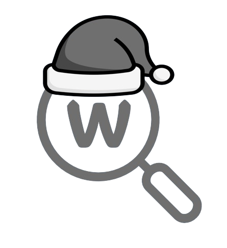

<div align="center">



# AlgoWiki · 알고리즘 위키

### 게임처럼 배우는 알고리즘

문제를 풀어 **퀘스트를 완료**하고, **경험치와 재화**를 얻고,<br>
그 재화로 **아이템을 사고 나를 꾸미는** — RPG 요소를 얹은 알고리즘 학습 플랫폼(PS 사이트)

<br>


`대학교 졸업작품` · `2023.11 ~ 2024.06` · 구 서비스 주소 `algowiki.co.kr`

<br>


</div>

<br>

---

## 목차

| 문서 | 내용 |
|---|---|
| **README** (이 문서) | 프로젝트 개요 · 화면 · 핵심 기능 |
| [docs/frontend.md](docs/frontend.md) | **프론트엔드 설계** — 화면을 어떻게 짰는지 |
| [docs/gamification.md](docs/gamification.md) | 퀘스트 · 레벨 · 재화 · 상점 · 아이템 설계 |
| [docs/architecture.md](docs/architecture.md) | 시스템 구조 · 채점기 연동 · 스케줄러 |
| [docs/file-map.md](docs/file-map.md) | **파일별 역할** — 어떤 PHP가 무엇을 하는지 |
| [docs/screens.md](docs/screens.md) | 화면별 상세 스크린샷 |

---

## 왜 만들었나

기존 알고리즘 학습 사이트(PS 사이트)는 **"문제를 푼다 → 맞았습니다"** 에서 끝난다.
초심자는 이 루프가 지루해서 이탈하고, 무엇을 다음에 풀어야 할지도 모른다.

AlgoWiki는 그 사이에 **게임의 보상 루프**를 넣었다.

```
문제 풀이 ──▶ 퀘스트 진행도 갱신 ──▶ 보상 수령 ──▶ EXP · 알고 코인
                    ▲                                     │
                    │                                     ▼
              매일/매주 새 퀘스트  ◀── 리롤·힌트 아이템 ◀── 상점에서 구매
                                                          │
                                                          ▼
                                              프로필 테두리 · 닉네임 컬러
                                                (자랑할 수 있는 것)
```

- **막히면** 힌트권·시간복잡도 확인권을 쓴다 → 포기 대신 진행
- **매일 오는 이유**를 만든다 → 일일 퀘스트, 출석 체크, 스트릭 잔디
- **모은 재화를 쓸 곳**을 만든다 → 상점, 프로필 꾸미기, 확률형 아이템

---

## 화면

<table>
<tr>
<td width="50%" align="center">
<br>
<b>메인</b><br><sub>히어로 · 문제 카드 스택 · 소식 섹션</sub>
</td>
<td width="50%" align="center">
<br>
<b>문제 목록</b><br><sub>카드형 · 태그 · 난이도 티어 · 필터</sub>
</td>
</tr>
<tr>
<td width="50%" align="center">
<br>
<b>퀘스트</b><br><sub>일일 / 주간 / 메인 · 육각형 아이콘 · 보상 수령</sub>
</td>
<td width="50%" align="center">
<br>
<b>상점</b><br><sub>특가 · 데일리 · 상시 · 프로필 테두리</sub>
</td>
</tr>
<tr>
<td width="50%" align="center">
<br>
<b>문제 페이지</b><br><sub>의도된 시간복잡도 · 힌트 · 아이템 힌트</sub>
</td>
<td width="50%" align="center">
<br>
<b>명예의 전당</b><br><sub>속도 · 메모리 · 숏코딩 · 선발대</sub>
</td>
</tr>
<tr>
<td width="50%" align="center">
<br>
<b>인벤토리</b><br><sub>보유 아이템 · 수량</sub>
</td>
<td width="50%" align="center">
<br>
<b>태그 / 위키</b><br><sub>알고리즘 개념 문서 · 추천 문제 연결</sub>
</td>
</tr>
</table>

> 전체 화면은 [docs/screens.md](docs/screens.md) 에서 볼 수 있습니다.
> 실제 동작 시연 영상: [`demo/algowiki-demo.mkv`](demo/algowiki-demo.mkv)

---

## 핵심 기능

### 퀘스트 — 문제 풀이에 목적을 붙이다

|  | 갱신 주기 | 성격 |
|---|---|---|
| **일일 퀘스트** | 매일 00시 초기화 | 출석 체크, `Random-Tag` 방어, 난이도별 랜덤 문제 |
| **주간 퀘스트** | 매주 초기화 | 알찬 한 주 — 누적형 목표 |
| **메인 퀘스트** | 영구 | 계정 성장의 큰 줄기 |
| **히든 퀘스트** | 영구 · 비공개 | 달성 전까지 `???` 로만 보임 |

- **Random-Tag 방어전** — 매일 태그 하나가 무작위로 배정되고, 그 태그가 붙은 문제를 풀어야 클리어
- **Random-Beginner / Normal / Advanced** — 난이도대별로 *아직 안 푼 문제* 중 하나가 지목됨
- **출석 체크**는 연속 출석(`7일 스트릭`) 퀘스트와 연동되어 함께 오른다

> 퀘스트 진행도는 **채점기가 정답 판정을 내리는 순간** C++ 훅에서 갱신됩니다.
> → [docs/architecture.md](docs/architecture.md)

<br>

### 성장 — 레벨 · 티어 · 재화


**난이도 티어** `None → Beginner → Easy → Normal → Advanced → Hard → Challenge`
각 티어가 다시 Ⅰ · Ⅱ 두 단계로 나뉘어 총 13단계. 문제 카드/문제 페이지에 색과 보석 아이콘으로 표시되고,
**"난이도 표시 안 함 / 항상 표시 / 내가 푼 문제만 표시"** 를 사용자가 설정에서 고를 수 있습니다.

<br clear="left">

- **EXP / LV** — 누적 경험치를 레벨 구간표에 **이분 탐색**으로 매핑해 현재 레벨과 다음 레벨까지의 진행률(%)을 계산
- **알고 코인** — 퀘스트 보상으로 지급되는 유일한 재화. 상점의 모든 소비가 여기서 나온다
- **스트릭 잔디** — GitHub 잔디처럼 일별 풀이량을 시각화. 잔디 색도 아이템으로 바꿀 수 있다

<br>

### 상점 & 인벤토리 — 재화를 쓸 곳

| 구획 | 특징 |
|---|---|
| **특가 상품** | 30시간 한정 · 할인율 표시 (프로필 테두리 최대 41% OFF) |
| **데일리 상품** | 6시간마다 교체되는 난이도별 힌트권 |
| **상시 상품** | 리롤권 · 힌트권 · 복권 · 확인권 |
| **프로필 테두리** | 36종 (정지 16 · 애니메이션 GIF 20), 개당 2,000 코인 |

<table>
<tr>
<td align="center" width="16%"><br><sub><b>힌트권</b><br>난이도별 힌트 해금</sub></td>
<td align="center" width="16%"><br><sub><b>시간복잡도<br>확인권</b><br>의도된 복잡도 공개</sub></td>
<td align="center" width="16%"><br><sub><b>일일퀘스트<br>리롤권</b></sub></td>
<td align="center" width="16%"><br><sub><b>닉네임 컬러<br>변경권</b><br>등급 1~4</sub></td>
<td align="center" width="16%"><br><sub><b>스트릭 컬러<br>변경권</b></sub></td>
<td align="center" width="16%"><br><sub><b>럭키 박스</b><br>코인 확률 지급</sub></td>
</tr>
</table>

확률형 아이템은 **모든 확률을 공개**합니다. 실제 서비스에 쓰인 확률표 원본이
[`templates/`](templates/) 에 그대로 들어 있습니다.

```
닉네임 컬러 변경권 1 → 7색 균등 14.28%
닉네임 컬러 변경권 4 → 24색, 최고 등급 6색은 각 3.33%
럭키 박스           → 0코인 50% · 100코인 32% · 200코인 10% · 300코인 5% · 500코인 3%
```

<br>

### 그 외

- **태그 / 위키** — 60여 개 알고리즘 태그. 각 태그에 직접 집필한 개념 문서(예: 분리 집합 — 경로 압축까지)와 추천 문제 연결
- **명예의 전당** — 문제별 **속도 · 메모리 · 숏코딩 · 선발대(최초 정답)** 4개 부문 시상대
- **채점 현황** — 폴링으로 새 채점 결과가 실시간 반영
- **게시판** — 자유 / 질문 / 신고 게시판 + 문제별 질문 게시판, 댓글, 검색
- **퀴즈** — 객관식 · 주관식 개념 퀴즈 (일일 퀘스트와 연동)
- **프로필** — GitHub 아바타 연동, Discord / Blog 링크, 한줄 소개, 소스 공개 여부 설정

---

## 프론트엔드

> 이 프로젝트의 **모든 화면(PHP 뷰 · CSS · 인터랙션 JS)은 AI 도움 없이 직접 설계하고 작성**했습니다.
> 상세 설계 노트는 [docs/frontend.md](docs/frontend.md) 에 정리해 두었습니다.

**빌드 도구도, 프레임워크도 없이** — 서버가 내려주는 PHP 문자열과 손으로 쓴 CSS만으로 위 화면들을 만들었습니다.

- **AJAX 부분 렌더링** — `*_db.php` 가 조각 HTML을 반환하고 jQuery가 DOM에 꽂아 넣는 구조.
  탭 전환·페이지네이션·필터가 전부 새로고침 없이 동작합니다.
- **CSS만으로 만든 탭** — 숨긴 `<input type="radio">` + `input:checked ~ #content` 조합. JS 없이 상태를 가집니다.
- **육각형 퀘스트 아이콘** — `outer-hexagon` / `inner-hexagon` 이중 클립으로 테두리 있는 육각형을 CSS만으로 구현
- **절대배치 카드 스택** — 메인의 지그재그 문제 카드는 `box1~box5` 좌표를 직접 잡고, 브레이크포인트마다 재배치
- **반응형** — `991px / 850px / 670px / 550px` + `pointer: coarse` 분기로 **"좁은 데스크톱"과 "터치 기기"를 다르게** 취급
- **글래스모피즘** — `backdrop-filter: blur(7px)` + 4방향 화이트 인셋 섀도우
- **시즌 연출** — 크리스마스에 GSAP + Vue로 눈 내리는 배경, 산타 모자 쓴 로고

---

## 시스템 구조

```
                        ┌──────────────────────────────┐
   Browser ── HTTP ────▶│  Apache + PHP  (웹 · 뷰 계층) │
        ▲               │  index / problem / userinfo   │
        │  AJAX 조각     │  quest / board / category     │
        └───────────────│                              │
                        └───────────┬──────────────────┘
                                    │
                             MariaDB (jol)
                    users · uinfo · problem · solution
                    quests · progress · accept · tag
                                    ▲
                        ┌───────────┴──────────────────┐
                        │  HUSTOJ judged (C++ 채점기)   │
                        │   └ quest_api  ← 직접 추가한 훅 │
                        └───────────┬──────────────────┘
                                    │
                        ┌───────────┴──────────────────┐
                        │  cron 스케줄러 (C++)          │
                        │   daily / weekly quest reset  │
                        └──────────────────────────────┘
```

핵심은 **채점기에 훅을 심은 것**입니다. 사용자가 문제를 맞히면 채점기가 결과를 쓰는 그 자리에서
`ac_api_process()` 가 호출되어 — 첫 정답인지 확인하고, 정답률을 갱신하고, 그 유저의 진행 중인 퀘스트를
분류(일일/주간/메인/히든)별로 순회하며 진행도를 올립니다. 웹 레이어는 결과만 읽습니다.

자세한 내용은 [docs/architecture.md](docs/architecture.md).

---

## 저장소 구조

```
AlgoWiki/
├─ src/
│  ├─ web/              실제 서비스에 올라가 있던 PHP · CSS 일체
│  │  ├─ index.php          메인 페이지
│  │  ├─ header.php         전역 헤더 / 내비게이션
│  │  ├─ problem/           문제 목록 · 문제 · 채점 현황 렌더러
│  │  ├─ userinfo/          프로필 · 퀘스트 · 상점 · 인벤토리 · 설정 탭
│  │  ├─ quest/             퀘스트 목록 · 보상 수령 엔드포인트
│  │  ├─ board/             게시판 (자유 / 질문 / 신고 / 검색)
│  │  └─ include/           DB 설정 (자격증명은 CHANGE_ME 로 치환됨)
│  └─ judge/
│     ├─ quest_api/         채점기에 심은 퀘스트 진행도 훅 (C++ 헤더)
│     └─ scheduler/         일일 / 주간 퀘스트 초기화 cron (C++)
├─ templates/           아이템 확률표 · 퀴즈 틀 HTML 원본
├─ assets/              실제 서비스에서 쓰던 이미지 전량
│  ├─ screenshots/          실제 화면 캡처
│  ├─ brand/                로고 · 파비콘 · 아이콘
│  ├─ main/                 메인 페이지 히어로 이미지
│  ├─ tier/                 난이도 티어 보석 (v1 / v2 / v3 리비전)
│  ├─ quest/                퀘스트 아이콘
│  ├─ border/               프로필 테두리 36종
│  └─ inventory/            아이템 아이콘
├─ docs/                설계 문서
├─ paper/               졸업 논문 (PDF)
├─ demo/                시연 영상
└─ archive/             초기 초안(drafts) · 개별 백업 사본
```

파일 하나하나의 역할은 [docs/file-map.md](docs/file-map.md) 에 표로 정리해 두었습니다.

---

## 문제 · 콘텐츠

- 사이트에 등록된 **알고리즘 문제 200여 개는 팀에서 직접 출제하고 상호 검토한 창작 문제**입니다.
- 각 문제에는 **의도된 시간복잡도**, 단계별 힌트, 아이템으로 해금되는 상세 힌트가 붙어 있습니다.
- 태그별 **위키 문서** 역시 직접 집필했습니다.

> 문제 본문 · 테스트 데이터는 서비스 DB에 있었으므로 이 저장소에는 포함되어 있지 않습니다.
> 문제 페이지의 실제 모습은 [`assets/screenshots/problem.png`](assets/screenshots/problem.png) 참고.

---

## 크레딧 · 라이선스

이 프로젝트는 오픈소스 온라인 저지 **HUSTOJ** 를 베이스로 시작해, 그 위에 게임화 시스템과
프론트엔드 전면을 새로 얹은 것입니다.

| | |
|---|---|
| **베이스 OJ** | [HUSTOJ](https://github.com/zhblue/hustoj) — © zhblue, **GPL** |
| **테마 원형** | [SYZOJ](https://github.com/syzoj/syzoj) 테마 (HUSTOJ 동봉 템플릿) |
| **웹폰트** | JalnanGothic (여기어때 잘난체) |

HUSTOJ가 GPL이므로 이 저장소도 **GPL-2.0** 을 따릅니다. 자세한 고지는 [NOTICE.md](NOTICE.md) 참고.

<div align="center">
<br>
<sub>AlgoWiki is powered by HUSTOJ, Theme by SYZOJ</sub>
<br><br>
</div>
