<div align="center">

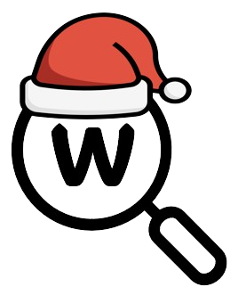

# AlgoWiki

### 게임처럼 배우는 알고리즘

문제를 풀어 **퀘스트를 완료**하고, **경험치와 재화**를 얻고,<br>
그 재화로 **아이템을 사고 나를 꾸미는** — RPG 요소를 얹은 알고리즘 학습 플랫폼

<br>


<br>

**대학교 졸업작품** &nbsp;·&nbsp; **2023.11 → 2024.06** &nbsp;·&nbsp; 구 서비스 주소 `algowiki.co.kr`

<br>

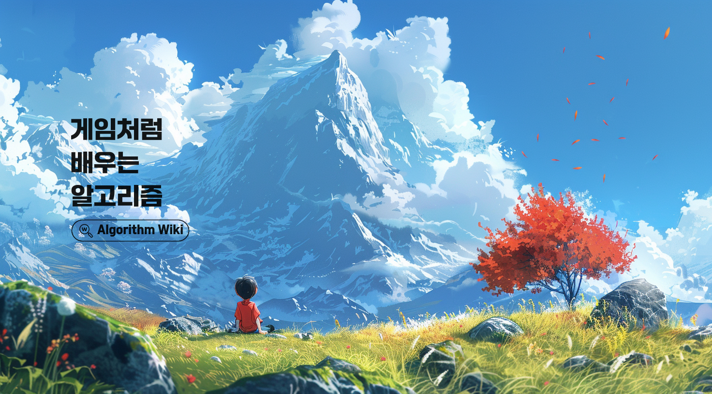

</div>

<br>

---

## 문서

| | |
|---|---|
| **[프론트엔드 설계](docs/frontend.md)** | 화면을 어떻게 짰는지 — 이 프로젝트의 중심 |
| **[웹 구조](docs/web-structure.md)** | 서버 배치 · URL 맵 · 라우팅 · 요청 흐름 |
| **[게임화 설계](docs/gamification.md)** | 퀘스트 · 레벨 · 재화 · 상점 · 아이템 |
| **[시스템 구조](docs/architecture.md)** | 화면이 얹혀 있는 서버 구성 — 개요 |
| **[파일별 역할](docs/file-map.md)** | 어떤 PHP가 무엇을 하는지 |
| **[화면 모음](docs/screens.md)** | 전체 스크린샷과 설명 |

---

## 왜 만들었나

기존 알고리즘 학습 사이트는 **"문제를 푼다 → 맞았습니다"** 에서 끝납니다.
초심자는 이 루프가 지루해서 이탈하고, 다음에 뭘 풀어야 할지도 모릅니다.

AlgoWiki는 그 사이에 **게임의 보상 루프**를 넣었습니다.

```
   문제 풀이 ──▶ 퀘스트 진행 ──▶ 보상 수령 ──▶ EXP · 알고 코인
       ▲                                          │
       │                                          ▼
   새 퀘스트 ◀──── 리롤 · 힌트 아이템 ◀────── 상점에서 구매
                                                  │
                                                  ▼
                                       프로필 테두리 · 닉네임 컬러
                                          (자랑할 수 있는 것)
```

| 기존 사이트의 문제 | AlgoWiki의 답 |
|---|---|
| 막히면 그냥 창을 닫는다 | 힌트권 · 시간복잡도 확인권 → **포기 대신 진행** |
| 내일 다시 올 이유가 없다 | 일일 퀘스트 · 출석 체크 · 스트릭 잔디 |
| 뭘 풀어야 할지 모른다 | 난이도대별 · 태그별로 **매일 문제를 지목** |
| 다 풀고 나면 볼 일이 없다 | 명예의 전당 — 속도 · 메모리 · 숏코딩 · 선발대 |

---

## 화면

> 제목을 클릭하면 스크린샷이 펼쳐집니다.

<details>
<summary><b>🏠 &nbsp;메인</b></summary>
<br>
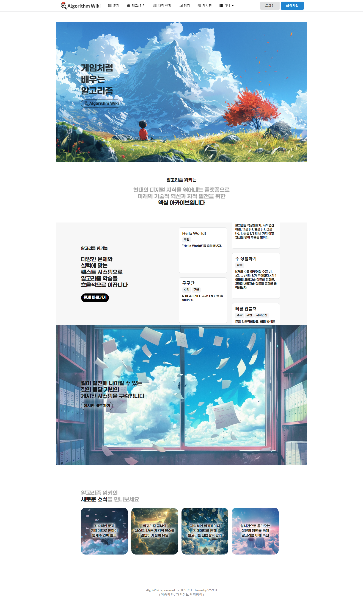
</details>

<details>
<summary><b>📋 &nbsp;문제 목록</b> &nbsp;— &nbsp;카드형 / 리스트형 · 태그 필터 · 난이도 티어</summary>
<br>
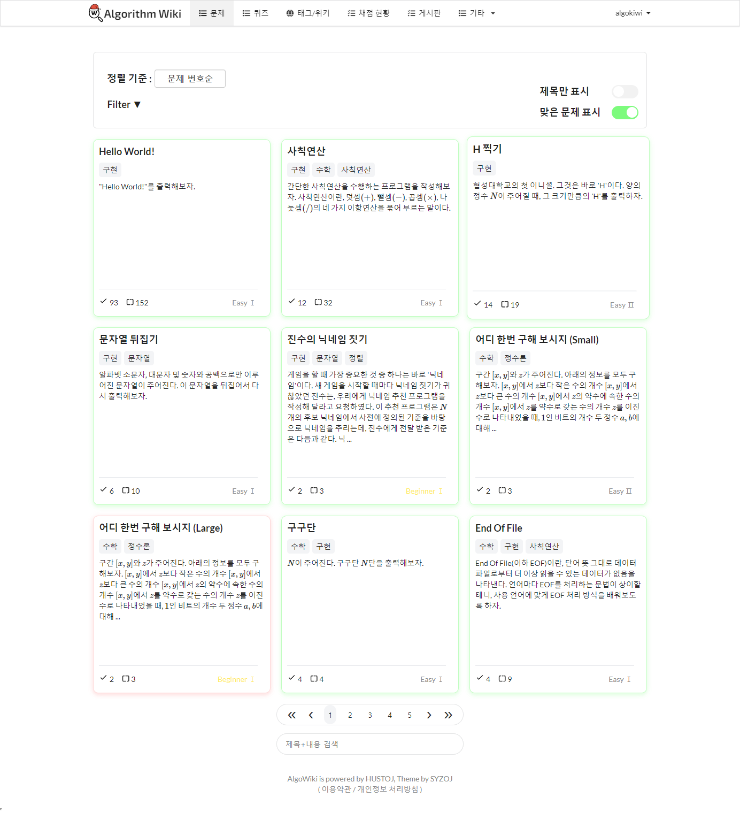
<br><br>
<b>"제목만 표시"</b> 토글을 켜면 밀도 높은 리스트 뷰로 전환됩니다.
<br><br>
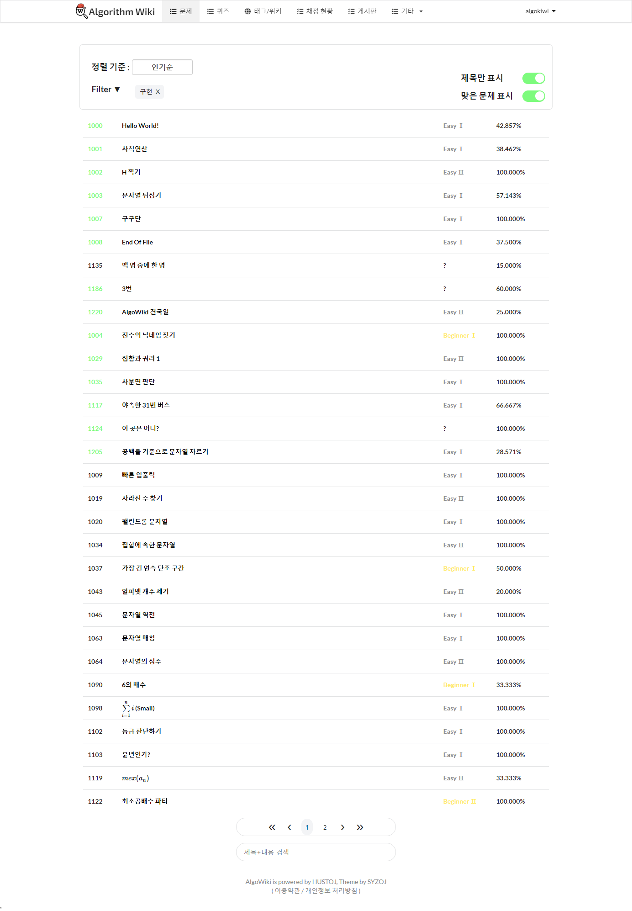
</details>

<details>
<summary><b>📝 &nbsp;문제 상세</b> &nbsp;— &nbsp;의도된 시간복잡도 · 힌트</summary>
<br>
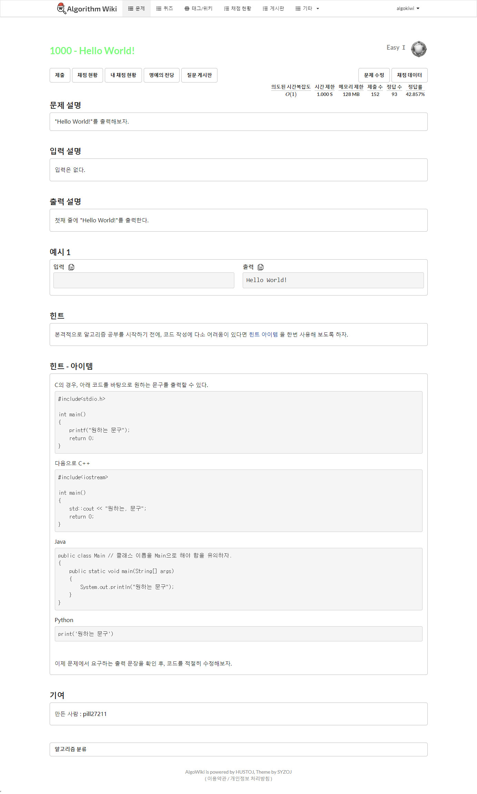
</details>

<details>
<summary><b>🧩 &nbsp;퀘스트</b> &nbsp;— &nbsp;일일 / 주간 / 메인 · 보상 수령</summary>
<br>
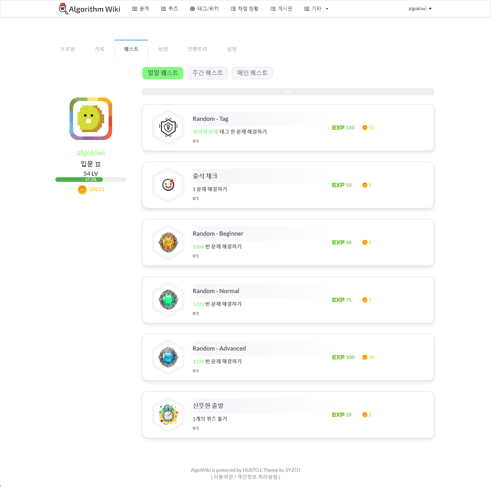
</details>

<details>
<summary><b>🛒 &nbsp;상점</b> &nbsp;— &nbsp;특가 · 데일리 · 상시 · 프로필 테두리</summary>
<br>
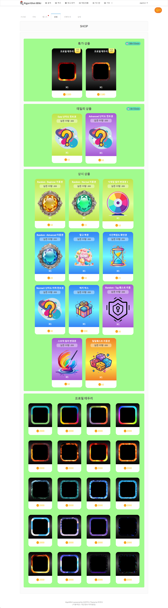
<br><br>
프로필 테두리는 <b>내 아바타를 끼운 상태로 미리보기</b> 됩니다.
<br><br>
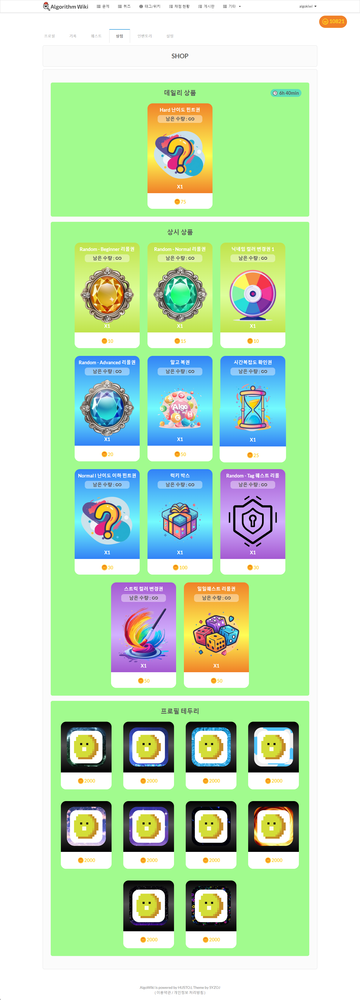
</details>

<details>
<summary><b>🎒 &nbsp;인벤토리</b> &nbsp;— &nbsp;보유 아이템 · 수량 · 사용</summary>
<br>
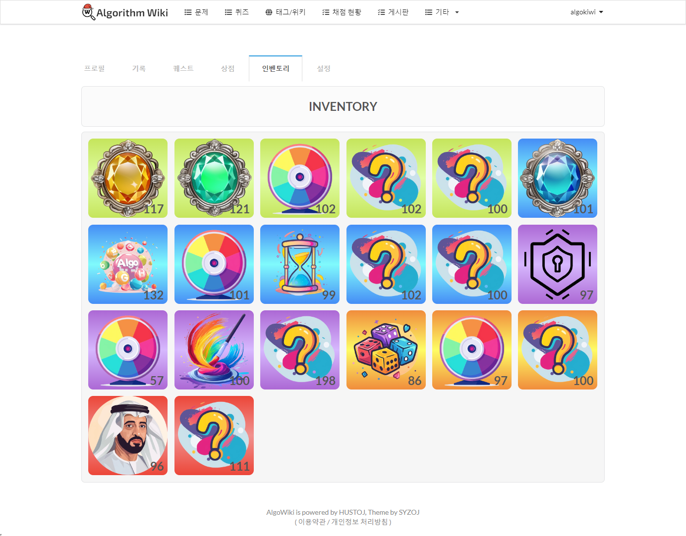
</details>

<details>
<summary><b>🏆 &nbsp;명예의 전당</b> &nbsp;— &nbsp;속도 · 메모리 · 숏코딩 · 선발대</summary>
<br>
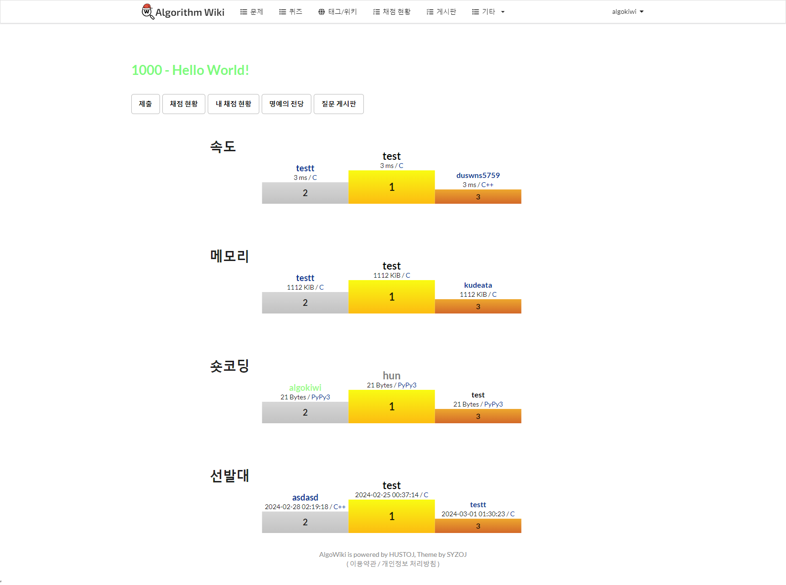
</details>

<details>
<summary><b>📚 &nbsp;태그 / 위키</b> &nbsp;— &nbsp;직접 집필한 알고리즘 개념 문서</summary>
<br>
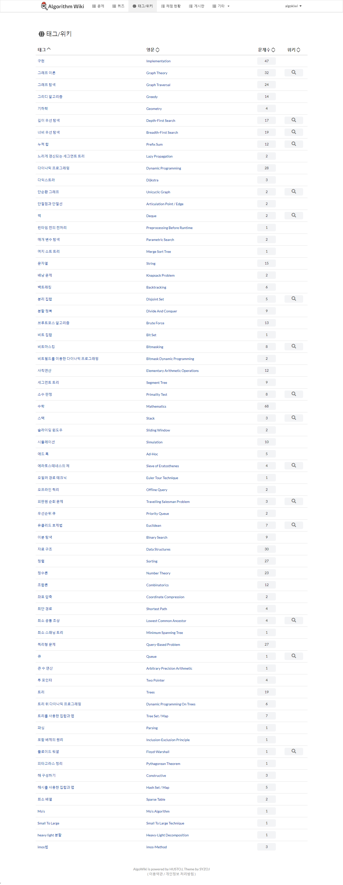
<br><br>
태그마다 개념 문서가 연결됩니다. 아래는 <b>분리 집합</b> 문서 — 경로 압축까지 다룹니다.
<br><br>
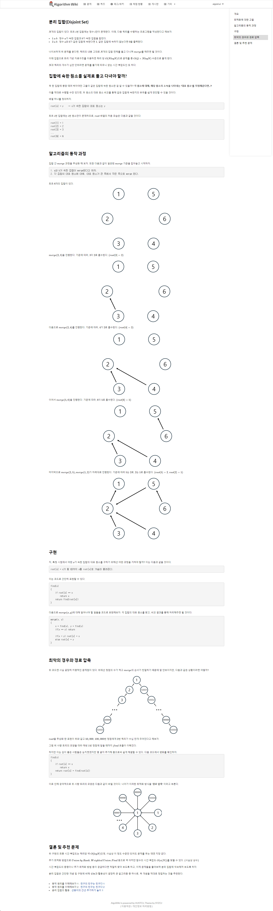
</details>

<details>
<summary><b>📊 &nbsp;채점 현황</b> &nbsp;— &nbsp;실시간 갱신 · 조건 검색</summary>
<br>
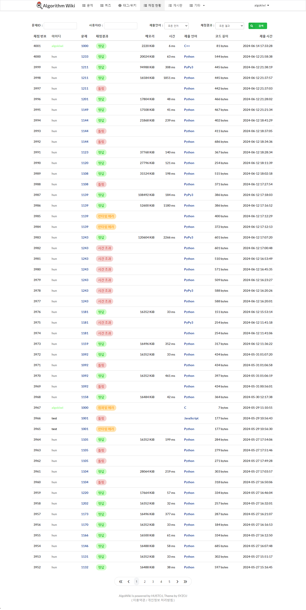
</details>

<details>
<summary><b>⚙️ &nbsp;제출 · 설정</b></summary>
<br>
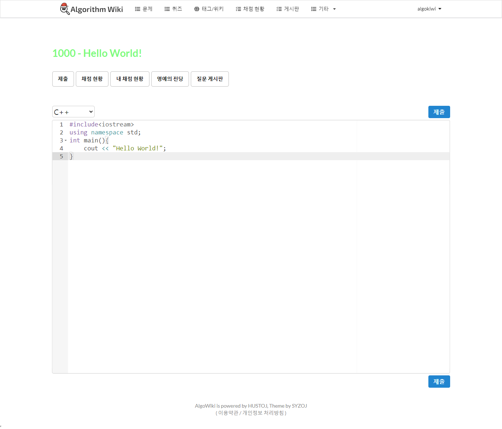
<br><br>
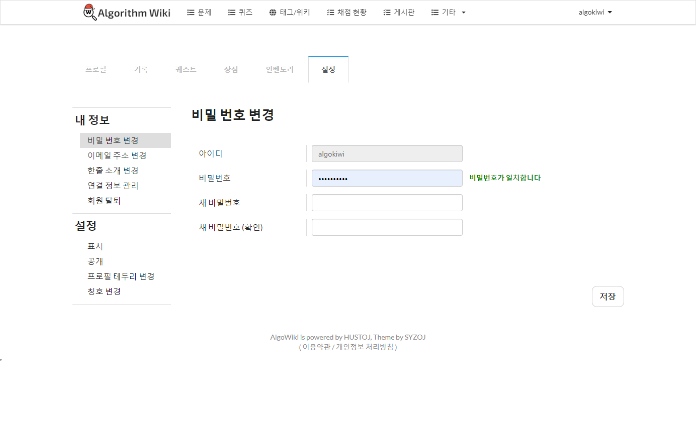
</details>

<br>

실제 동작 시연 영상 — [`demo/algowiki-demo.mkv`](demo/algowiki-demo.mkv)

---

## 핵심 기능

### 퀘스트 — 문제 풀이에 목적을 붙이다

| | 갱신 | 성격 |
|---|---|---|
| **일일** | 매일 00시 | 출석 체크 · `Random-Tag` 방어 · 난이도별 랜덤 문제 |
| **주간** | 매주 | 알찬 한 주 — 누적형 목표 |
| **메인** | 영구 | 계정 성장의 큰 줄기 |
| **히든** | 영구 · 비공개 | 달성 전까지 `???` 로만 보임 |

- **Random-Tag 방어전** — 매일 태그 하나가 무작위 배정되고, 그 태그의 문제를 풀어야 클리어
- **Random-Beginner / Normal / Advanced** — 난이도대별로 *아직 안 푼 문제* 중 하나가 지목
- **출석 체크** — 연속 출석(7일 스트릭) 퀘스트와 연동되어 함께 상승

> [!NOTE]
> 퀘스트 진행도는 **채점기가 정답을 판정하는 순간** 갱신됩니다.
> 화면에서 계산하지 않으니 탭을 열어두든 닫아두든 값이 어긋나지 않습니다.

<br>

### 성장 — 레벨 · 티어 · 재화

<div align="center">
<table>
<tr>
<td align="center"><br><sub>None</sub></td>
<td align="center"><br><sub>Beginner</sub></td>
<td align="center"><br><sub>Easy</sub></td>
<td align="center">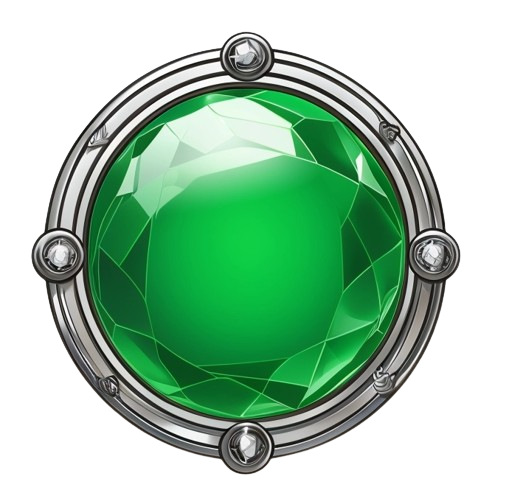<br><sub>Normal</sub></td>
<td align="center">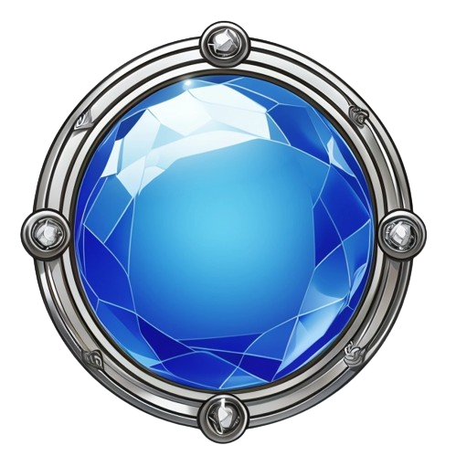<br><sub>Advanced</sub></td>
<td align="center">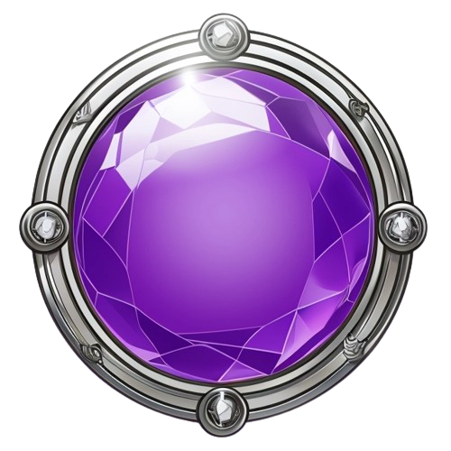<br><sub>Hard</sub></td>
<td align="center">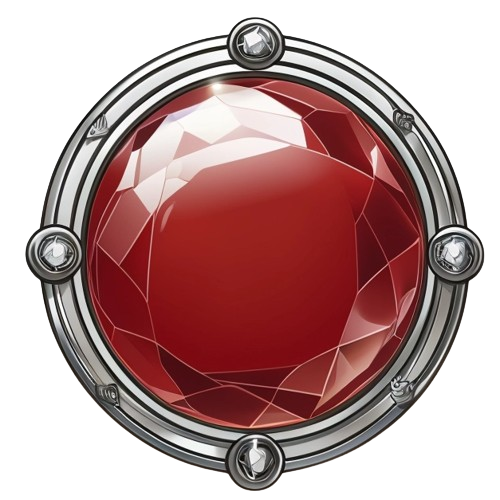<br><sub>Challenge</sub></td>
</tr>
</table>
</div>

- **난이도 티어** — 7단계 × Ⅰ · Ⅱ = **총 13단계**.
  *"표시 안 함 / 항상 표시 / 내가 푼 문제만 표시"* 를 사용자가 직접 고릅니다
- **EXP / LV** — 누적 경험치를 레벨 구간표에 **이분 탐색**해 레벨과 진행률을 계산
- **알고 코인** — 퀘스트 보상으로만 얻는 유일한 재화. 현금 결제 경로는 없습니다
- **스트릭 잔디** — GitHub 잔디처럼 일별 풀이량을 시각화. 색도 아이템으로 바꿉니다

<br>

### 상점 & 아이템 — 재화를 쓸 곳

<div align="center">
<table>
<tr>
<td align="center" width="16%"><br><sub><b>힌트권</b><br>난이도별 해금</sub></td>
<td align="center" width="16%">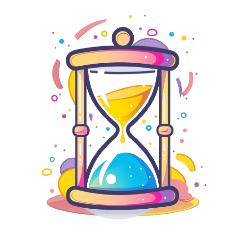<br><sub><b>시간복잡도<br>확인권</b></sub></td>
<td align="center" width="16%">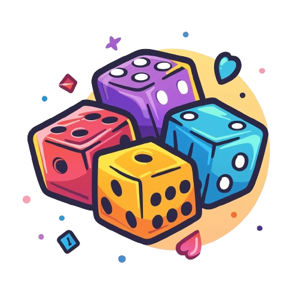<br><sub><b>일일퀘스트<br>리롤권</b></sub></td>
<td align="center" width="16%">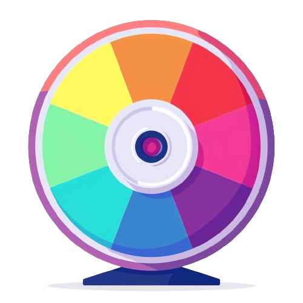<br><sub><b>닉네임 컬러<br>변경권</b></sub></td>
<td align="center" width="16%"><br><sub><b>스트릭 컬러<br>변경권</b></sub></td>
<td align="center" width="16%">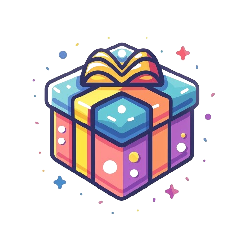<br><sub><b>럭키 박스</b></sub></td>
</tr>
</table>
</div>

| 구획 | 특징 |
|---|---|
| **특가 상품** | 48시간 한정 · 할인율 배지 |
| **데일리 상품** | 24시간마다 교체되는 난이도별 힌트권 |
| **상시 상품** | 리롤권 · 힌트권 · 복권 · 확인권 |
| **프로필 테두리** | **36종** — 정지 16 · 애니메이션 GIF 20 |

<div align="center">


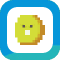
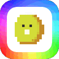
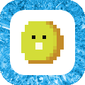
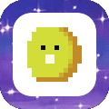
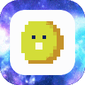
<br>
</div>

> [!TIP]
> 닉네임 색을 **사이트 전역**(채점 현황 · 랭킹 · 게시판)에 반영한 게 중요한 결정이었습니다.
> 프로필 안에서만 보이면 아무도 사지 않습니다. 남의 눈에 띄어야 재화를 쓸 이유가 생깁니다.

<br>

### 그 외

- **태그 / 위키** — 60여 개 태그. 각 태그에 직접 집필한 개념 문서와 추천 문제 연결
- **명예의 전당** — 문제별 **속도 · 메모리 · 숏코딩 · 선발대** 4개 부문 시상대
- **채점 현황** — 최신 제출만 가볍게 감시하다 변화가 있을 때만 목록 갱신
- **게시판** — 자유 / 질문 / 신고 + 문제별 질문 게시판, 댓글, 검색
- **퀴즈** — 객관식 · 주관식 개념 퀴즈 (일일 퀘스트 연동)
- **프로필** — GitHub 아바타 연동, Discord / Blog 링크, 공개 범위 개별 설정

---

## 프론트엔드

> [!IMPORTANT]
> 이 프로젝트의 **모든 화면 — PHP 뷰 · CSS · 인터랙션 JS — 은 AI 도움 없이 직접 설계하고 작성**했습니다.
> 설계 노트: [docs/frontend.md](docs/frontend.md)

**빌드 도구도, 프레임워크도 없이** — 서버가 내려주는 PHP 문자열과 손으로 쓴 CSS만으로 위 화면들을 만들었습니다.

| | |
|---|---|
| **AJAX 부분 렌더링** | `*_db.php` 가 조각 HTML을 반환하고 jQuery가 DOM에 꽂는 구조.<br>탭 · 페이지네이션 · 필터가 전부 새로고침 없이 동작 |
| **CSS만으로 만든 탭** | 숨긴 `<input type="radio">` + `input:checked ~ #content`.<br>JS 없이 상태를 가집니다 |
| **육각형 아이콘** | `outer` / `inner` 이중 `clip-path` 로 테두리 있는 육각형 구현 |
| **절대배치 카드 스택** | 메인의 지그재그 카드는 `box1~box5` 좌표를 직접 잡고<br>브레이크포인트마다 재배치 |
| **반응형** | `991 / 850 / 670 / 550px` + `pointer: coarse` 로<br>**"좁은 데스크톱"과 "터치 기기"를 다르게** 취급 |
| **글래스모피즘** | `backdrop-filter: blur(7px)` + 4방향 화이트 인셋 섀도우 |
| **보상 연출** | 수령 시 좌우 두 지점에서 폭죽, 남은 시간에 비례해 입자 감소 |
| **시즌 연출** | 크리스마스에 GSAP + Vue로 눈 내리는 배경, 산타 모자 쓴 로고 |

---

## 시스템 구조

```
   Browser ──── HTTP ────▶  Apache + PHP  (웹 · 뷰 계층)
       ▲                              │
       └──── AJAX 조각 ────────────────┤
                                      ▼
                                   MariaDB
                                      ▲
                    ┌─────────────────┴─────────────────┐
                    │                                   │
            HUSTOJ 채점기                        cron 스케줄러
         └ 퀘스트 훅 ★ 직접 추가                 └ 일일 / 주간 초기화 ★
```

AWS EC2 단일 인스턴스 위에 Apache + PHP + MariaDB + HUSTOJ 채점기.
게임화에 필요한 두 조각(**채점 시 퀘스트 진행도 갱신**, **매일·매주 퀘스트 초기화**)만
직접 얹고, 나머지 채점 파이프라인은 HUSTOJ를 그대로 썼습니다.

→ [docs/architecture.md](docs/architecture.md)

---

## 저장소 구조

```
AlgoWiki/
├─ src/
│  ├─ web/              실제 서비스에 올라가 있던 PHP · CSS
│  │  ├─ index.php          메인 페이지
│  │  ├─ header.php         전역 헤더 / 내비게이션 (테마 계층)
│  │  ├─ problem_list.php   문제 목록  ·  problem.php   문제 상세
│  │  ├─ status.php         채점 현황  ·  category.php  태그/위키
│  │  ├─ userinfo.php       프로필 라우터 · quiz.php    퀴즈
│  │  ├─ board.php          게시판 라우터 + 글/댓글 액션
│  │  ├─ problem/           문제 · 채점 현황 렌더러 (_header / _db)
│  │  ├─ userinfo/          프로필 · 퀘스트 · 상점 · 인벤토리 · 설정 탭
│  │  ├─ quest/             퀘스트 목록 · 보상 수령 엔드포인트
│  │  └─ board/             게시판 분류별 뷰
│  └─ judge/
│     ├─ quest_api/         채점기에 심은 퀘스트 진행도 훅 (C++)
│     └─ scheduler/         일일 / 주간 퀘스트 초기화 cron (C++)
├─ assets/              실제 서비스에서 쓰던 이미지 전량
│  ├─ screenshots/          화면 캡처 15장
│  ├─ brand/                로고 · 파비콘 · 아이콘
│  ├─ main/                 메인 히어로 이미지
│  ├─ tier/                 난이도 티어 보석 (v1 / v2 / v3)
│  ├─ quest/                퀘스트 아이콘 29종
│  ├─ border/               프로필 테두리 36종
│  └─ inventory/            아이템 아이콘
├─ templates/           아이템 · 퀴즈 마크업 원본 (서비스에 쓰인 HTML 조각)
├─ docs/                설계 문서
├─ paper/               졸업 논문 (PDF)
└─ demo/                시연 영상
```

서버 배치와 요청 흐름 → [docs/web-structure.md](docs/web-structure.md)
파일 하나하나의 역할 → [docs/file-map.md](docs/file-map.md)

> [!NOTE]
> 이 저장소에는 **AlgoWiki 팀이 직접 만든 것만** 담았습니다.
> HUSTOJ가 제공하는 채점기 · 코어 인클루드 · 인증 · 랭킹 · 관리자 페이지는 포함하지 않고
> 출처만 [NOTICE.md](NOTICE.md) 에 남겼습니다.

---

## 문제 · 콘텐츠

- 사이트에 등록된 **알고리즘 문제 200여 개는 팀에서 직접 출제하고 상호 검토한 창작 문제**입니다
- 각 문제에 **의도된 시간복잡도**, 단계별 힌트, 아이템으로 해금되는 상세 힌트를 붙였습니다
- 태그별 **알고리즘 위키 문서** 역시 직접 집필했습니다

> 문제 본문 · 테스트 데이터 · 위키 본문은 서비스 DB에 있었으므로 이 저장소에 포함되어 있지 않습니다.

---

## 크레딧 · 라이선스

오픈소스 온라인 저지 **HUSTOJ** 를 베이스로 시작해, 그 위에 게임화 시스템과
프론트엔드 전면을 새로 얹은 프로젝트입니다.

| | |
|---|---|
| **베이스 OJ** | **[HUSTOJ](https://github.com/zhblue/hustoj)** — © zhblue, GPL |
| **테마 원형** | [SYZOJ](https://github.com/syzoj/syzoj) 테마 (HUSTOJ 동봉 템플릿) |
| **웹폰트** | JalnanGothic (여기어때 잘난체) |

HUSTOJ가 GPL이므로 이 저장소도 **[GPL-2.0](LICENSE)** 을 따릅니다.
전체 고지는 [NOTICE.md](NOTICE.md) 를 참고하세요.

<br>

<div align="center">
<sub>AlgoWiki is powered by HUSTOJ, Theme by SYZOJ</sub>
<br><br>
</div>
